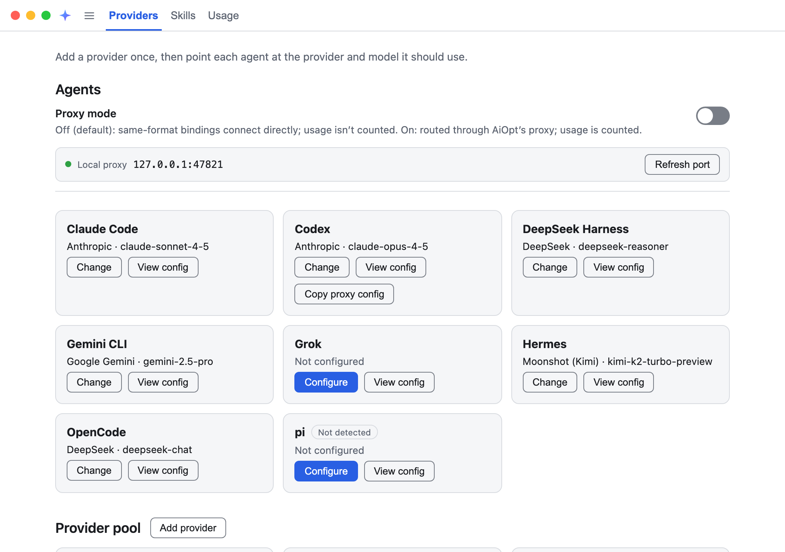
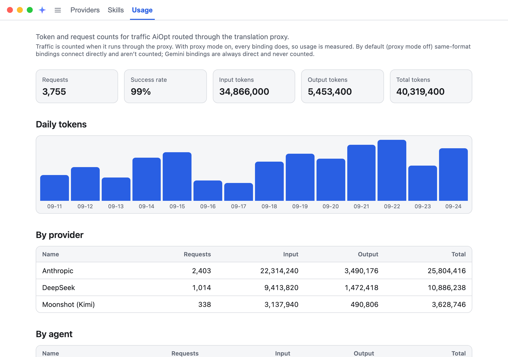
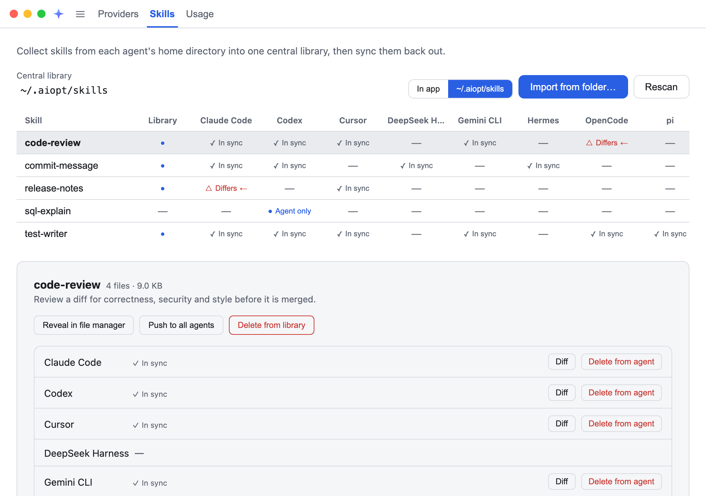

# AiOpt

[English](README.md) | [简体中文](README.zh-CN.md) | [日本語](README.ja.md) | 한국어

**하나의 공급자 풀, 모든 에이전트 CLI, 어떤 API 형식이든.**

AiOpt는 AI 코딩 에이전트를 실제로 토큰 비용을 지불하고 싶은 모델 공급자로 라우팅하는 데스크톱 앱입니다.
공급자의 엔드포인트, 키, 모델을 한 번만 입력하면, 클릭 한 번으로 Claude Code, Codex, Gemini CLI, OpenCode
등 지원되는 에이전트를 그 공급자로 연결할 수 있습니다. 에이전트와 공급자가 서로 다른 API 형식을 쓰면 AiOpt의
로컬 프록시가 그 사이를 변환합니다. Codex를 Anthropic 모델로, Claude Code를 임의의 OpenAI 호환 엔드포인트로
실행할 수 있으며, 관리해야 할 플래그, 래퍼, 환경 변수는 없습니다.

<picture>
  <source media="(prefers-color-scheme: dark)" srcset="docs/images/screenshots/providers-dark.png">
  
</picture>

## AiOpt가 해결하는 문제

에이전트 CLI마다 자체 설정 파일, 자체 키 위치, 자체 API 형식이 있습니다. 모델을 바꾸려면
`~/.claude/settings.json`을 직접 고치고, 이어서 `~/.codex/config.toml`, 또 다른 곳의 YAML 파일까지 —
같은 키를 하나하나 붙여 넣어야 합니다. 에이전트가 지원하지 않는 형식의 공급자는 아예 써 볼 수도 없습니다.

AiOpt는 이를 공급자를 관리하는 한 곳, 에이전트마다 하나의 스위치, 그리고 형식 차이를 없애는 변환 계층으로
바꿉니다.

## 기능

### 공급자 풀

- **한 번 추가하고 어디서나 재사용.** 공급자는 이름, API 형식, 기본 URL, 키, 모델 목록으로 이루어집니다.
  모든 에이전트가 같은 풀을 사용합니다.
- Anthropic, OpenAI, DeepSeek, Moonshot(Kimi) **프리셋**, 또는 임의의 게이트웨이·릴레이·자체 호스팅
  엔드포인트를 위한 **사용자 지정…**.
- **모델 불러오기**로 ID를 직접 입력하는 대신 공급자의 모델 목록에서 바로 가져옵니다.
- **별칭**을 쓰면 긴 모델 ID 대신 더 짧거나 에이전트에 맞는 이름을 에이전트에 기록합니다.
- **업스트림 호환성**은 전달 전에 지정한 최상위 요청 필드를 제거합니다. 모르는 매개변수를 무시하지 않고
  거부하는 엄격한 게이트웨이를 위한 기능입니다.

### 원클릭 에이전트 바인딩

인식되는 에이전트 CLI는 9개입니다: **Claude Code, Codex, Cursor, DeepSeek Harness, Gemini CLI, Grok,
Hermes, OpenCode, pi**. 그중 8개는 공급자에 바인딩할 수 있습니다. Cursor의 CLI는 기본 URL을 재정의할 수
없으므로 스킬 동기화에만 참여합니다.

- 에이전트 카드에서 공급자와 모델을 고르고 적용하면 됩니다. AiOpt는 에이전트 **자체의 네이티브 설정 파일**에
  기록하므로 에이전트는 이전과 똑같이 실행됩니다 — 런처도, 셸 별칭도 필요 없습니다.
- **독점** 에이전트는 활성 공급자가 교체되고, **추가** 에이전트(DeepSeek Harness, Hermes, OpenCode)는 모든
  공급자를 나란히 유지하며 기본값만 바뀝니다.
- 어떤 파일이든 처음 기록하기 전에 AiOpt는 **원본 그대로**를 `<file>.aiopt.bak`으로 보관합니다.
  **기본값 복원**은 이를 정확히 되돌리며, AiOpt가 만든 파일이라면 삭제합니다.
- **설정 보기**는 AiOpt가 관리하는 파일과 그 위치를 나열하지만, 내용은 절대 표시하지 않습니다(그중 몇몇에는
  키가 들어 있습니다).

### 형식 간 변환 프록시

| 에이전트 형식 → 공급자 형식 | 상태 |
| --- | --- |
| Anthropic Messages → OpenAI Chat Completions | 활성 |
| OpenAI Responses → OpenAI Chat Completions | 활성 |
| OpenAI Responses → Anthropic Messages(추론 브리지 포함) | 활성 |
| OpenAI Chat Completions → Anthropic Messages | 예약됨 |

- **루프백 서버 하나, `127.0.0.1` 포트 하나, 바인딩마다 경로 하나.** 각 바인딩은 URL 경로에 불투명한 토큰을
  가지며, 요청 본문으로 추측하는 대신 경로가 변환 방향을 결정합니다. 그래서 반대 방향의 바인딩이 같은 포트를
  공유해도 서로 간섭하지 않습니다.
- **스트리밍과 도구 호출도 변환됩니다.** 일반 텍스트만이 아닙니다 — Server-Sent Events를 양방향으로 이벤트
  단위로 다시 구성합니다.
- **추론 브리지**는 Claude의 확장 사고 블록과 그 서명을 상태가 없는 Responses 프로토콜을 통해 전달합니다.
  그래서 Claude 모델로 실행되는 Codex의 여러 턴 세션에서도 추론이 끊기지 않습니다.
- **충실하게 변환할 수 없는 필드는 조용히 버리지 않고 명확한 오류로 거부**합니다. 에이전트가 모르는 사이에
  다른 답을 받는 일은 없습니다.
- **재시작해도 그대로입니다.** 포트와 바인딩별 토큰이 유지되므로, 이미 실행 중인 에이전트는 AiOpt를 재시작한
  뒤에도 계속 작동합니다. 바인딩의 대상이 바뀌는 순간 토큰이 교체되고, 바인딩을 해제하면 무효가 됩니다.
  다른 프로그램이 포트를 차지하면 **포트 새로 고침**으로 프록시를 옮길 수 있습니다.

### 프록시 모드

- **끄기(기본값):** 같은 형식끼리의 바인딩은 에이전트를 공급자에 **직접** 연결하며, AiOpt가 실행 중이 아니어도
  계속 작동합니다. 에이전트가 직접 키를 보내야 하므로 공급자의 키가 에이전트 설정 파일에 기록됩니다.
- **켜기:** 모든 바인딩이 로컬 프록시를 거칩니다. 에이전트 설정에는 루프백 토큰만 남고, **실제 키는 AiOpt의
  암호화된 저장소를 떠나지 않으며**, 사용량이 집계됩니다. 에이전트가 프록시에 의존하고 있으면 AiOpt는 종료
  전에 확인합니다.
- 형식이 다른 바인딩은 항상 프록시를 사용하고, Gemini 바인딩은 항상 직접 연결됩니다.

### 사용량

프록시를 거친 트래픽에 대해 요청 수, 성공률, 입력 / 출력 / 전체 토큰을 집계하고, 일별 차트와 **공급자별·
에이전트별·모델별** 분석을 제공합니다. 응답에서는 숫자로 된 사용량 필드만 읽으며, 내용은 절대 읽지 않습니다.

<picture>
  <source media="(prefers-color-scheme: dark)" srcset="docs/images/screenshots/usage-dark.png">
  
</picture>

### 스킬 동기화

에이전트 스킬을 하나의 **중앙 라이브러리**(앱 데이터 안, 또는 `~/.aiopt/skills`)에 모아 각 에이전트의 스킬
디렉터리로 동기화합니다.

- **가져오기 ←**로 에이전트의 스킬을 라이브러리로, **내보내기 →**로 라이브러리 사본을 에이전트로 보내거나,
  **모든 에이전트로 내보내기**로 한 번에 배포합니다.
- **비교**는 파일 단위 변경 사항을 내용 미리보기와 함께 보여 주고, **병합**에서는 라이브러리에 어느 쪽을 남길지
  파일별로 고를 수 있습니다.
- 모든 덮어쓰기는 원자적입니다. 심볼릭 링크는 거부되고 크기 제한이 적용되므로, 엉뚱한 링크나 비대해진
  디렉터리가 복사될 수 없습니다.

<picture>
  <source media="(prefers-color-scheme: dark)" srcset="docs/images/screenshots/skills-dark.png">
  
</picture>

### 일상의 편의

- **프록시 구성 복사**는 프록시 경로의 OpenAI 호환 스니펫을 클립보드에 넣어, 다른 도구도 같은 경로로 연결할 수
  있게 합니다.
- **메뉴 막대 / 시스템 트레이**에 상주하며, 창을 닫아도 프록시는 계속 실행됩니다.
- **7개의 인터페이스 언어**(English, 简体中文, 日本語, 한국어, Français, Deutsch, Español), 라이트 / 다크 /
  시스템 테마, 변경 가능한 키보드 단축키.

## 시작하기

### 설치

**macOS(Apple Silicon)는 Homebrew로 설치하는 것을 권장합니다.**

```sh
brew install --cask rushteam/tap/aiopt
```

이 cask는 **AiOpt.app**을 `/Applications`에 설치하고 macOS 격리 플래그를 지우므로, 첫 실행 때 Gatekeeper
확인 창이 뜨지 않습니다. `brew upgrade --cask aiopt`로 새 릴리스로 업그레이드하고, `brew uninstall --cask aiopt`로
앱을 제거합니다. `--zap`을 붙이면 저장된 키를 포함한 데이터도 삭제됩니다.

모든 플랫폼에서 빌드를 직접 내려받을 수도 있습니다. 빌드는 각
[GitHub Release](https://github.com/rushteam/aiopt/releases)에 첨부되며, 태그된 커밋에서 세 플랫폼 모두에 대해
빌드됩니다.

| 플랫폼 | 받을 파일 | 설치 방법 |
| --- | --- | --- |
| macOS | `.zip` | 압축을 풀고 **AiOpt.app**을 `/Applications`로 드래그합니다. |
| Windows | `Setup.exe` | 실행하면 됩니다. Squirrel이 사용자 단위로 설치하며 관리자 권한 요청은 없습니다. |
| Linux | `.zip` | 원하는 곳에 압축을 풀고 `AiOpt` 바이너리를 실행합니다. |

**macOS 빌드는 현재 Apple Silicon(arm64) 전용입니다.** Intel Mac에서는 소스에서 실행하세요.

#### 빌드는 서명되지 않았습니다 — 먼저 읽어 주세요

아직 코드 서명 인증서가 없어서 **macOS와 Windows 모두 내려받은 빌드를 첫 실행 시 거부합니다.** 설치할 때마다
한 번, 의도적으로 넘어가야 하는 차단입니다. Homebrew cask는 이 단계를 대신 처리합니다.

- **macOS** — 처음 더블클릭하면 "개발자를 확인할 수 없기 때문에 'AiOpt'을(를) 열 수 없습니다"라는 메시지가
  나옵니다. 이를 닫은 다음 **앱을 오른쪽 클릭(또는 Control-클릭) → 열기**를 선택하고, 두 번째 대화 상자에서
  확인합니다. 그래도 macOS가 거부하면 **시스템 설정 → 개인정보 보호 및 보안**을 열고, AiOpt 관련 메시지까지
  스크롤해 **확인 없이 열기**를 클릭합니다.
  대신 AiOpt가 **손상되었기 때문에 열 수 없다**고 나오면 [자주 묻는 질문](#자주-묻는-질문)을 참고하세요.
- **Windows** — SmartScreen이 파란색 "Windows의 PC 보호" 화면을 표시합니다. **추가 정보**를 클릭한 뒤
  **실행**을 클릭합니다.
- **Linux** — 앱을 막는 것은 없습니다.

파일의 출처를 신뢰할 때만 이렇게 하세요 — 악성 코드도 똑같은 단계를 요구합니다. 서명은 계획되어 있습니다
(`docs/dev-rules/development-workflow.md` §6 참고).

### 처음 실행하기

AiOpt는 에이전트 CLI의 설정과 형식 변환을 관리할 뿐, 스스로 모델과 통신하지 않습니다.

1. **공급자 추가** — 공급자 → **공급자 추가**. 프리셋이나 **사용자 지정…**을 고르고, API 키를 붙여 넣은 뒤
   사용할 모델을 불러오거나 나열합니다. 키는 OS 암호화 비밀 저장소에 들어갑니다. 양식을 다시 열면 키 대신
   "키가 저장됨"이 표시되며, **표시**를 눌렀을 때만 다시 보입니다.
2. **에이전트 바인딩** — 에이전트 카드에서 **구성**을 선택하고, 공급자와 모델을 고른 뒤 **적용**합니다.
   AiOpt는 해당 에이전트의 설정 파일(`~/.claude/settings.json`, `~/.codex/config.toml` 등)을 공급자나 로컬
   프록시를 가리키도록 다시 씁니다.
3. **평소처럼 에이전트를 사용합니다.** 나중에 같은 카드에서 모델을 바꿀 수 있고, **기본값 복원**은 에이전트의
   설정을 원래 그대로 돌려놓습니다.

**AiOpt는 다른 도구의 설정 파일을 편집합니다.** `shared/aiProviders.ts`에 에이전트별로 선언된 특정 파일만
기록하고 각각을 먼저 백업하지만, 직접 설정해 둔 파일일 수도 있습니다. 바인딩하기 전에 **설정 보기**로
확인하세요.

## 자주 묻는 질문

### macOS에서 "'AiOpt'이(가) 손상되었기 때문에 열 수 없습니다. 해당 항목을 휴지통으로 이동해야 합니다."라고 나옵니다

파일은 손상되지 않았습니다. 빌드가 Apple Developer ID로 서명되지 않았고 공증도 받지 않았는데, macOS는
브라우저로 내려받은 모든 파일에 격리(quarantine) 플래그를 붙입니다. 그래서 Gatekeeper가 앱을 거부하며,
Apple Silicon과 최신 macOS에서는 흔히 "손상됨"으로 표시합니다 — **확인 없이 열기** 버튼도 없고, 오른쪽 클릭
→ 열기로도 넘어갈 수 없습니다.

**AiOpt.app**을 `/Applications`로 옮긴 다음, 터미널에서 격리 플래그를 포함한 확장 속성을 지웁니다.

```sh
sudo xattr -cr /Applications/AiOpt.app
```

그다음 평소처럼 엽니다. 그래도 실행되지 않으면 — 바로 종료되거나 다시 손상되었다고 나오면 — 임시(ad-hoc)
서명을 다시 붙이고 한 번 더 시도하세요.

```sh
codesign --force --deep --sign - /Applications/AiOpt.app
```

이 저장소의 [Releases](https://github.com/rushteam/aiopt/releases) 페이지에서 내려받은 파일에만 이렇게
하세요. Homebrew로 설치했다면 이 단계가 필요 없습니다. 빌드가 서명·공증되면 누구에게도 필요 없어집니다.

## 설계

### 보안이 곧 아키텍처

AiOpt는 API 키를 보관하고 홈 디렉터리의 파일을 다시 씁니다. 그래서 보안 모델은 덧붙인 계층이 아니라
아키텍처 그 자체입니다.

- **UI는 신뢰하지 않습니다.** 인터페이스는 샌드박스와 컨텍스트 격리가 적용되고 Node에 접근할 수 없는
  렌더러에서 실행됩니다. 최소한의 preload는 용도별로 이름 붙인 메서드만 노출하며, 메인 프로세스의 모든 IPC
  핸들러는 무엇이든 하기 전에 **발신자를 확인한 다음 페이로드를 런타임에 검증**합니다.
- **키는 OS가 암호화합니다.** Electron `safeStorage`를 통해 macOS에서는 키체인, Windows에서는 DPAPI,
  Linux에서는 사용 가능한 경우 데스크톱 키링을 사용합니다. 키는 UI, 로그, 버전 관리 대상 파일에 절대 닿지
  않습니다.
- **프록시는 루프백에만 바인딩**하고, 모든 요청을 경로 토큰으로 인증하며, 실제 키는 나가는 요청에만 넣습니다.
  업스트림 오류 본문은 전달하지 않고(키를 그대로 되돌려 줄 수 있으므로), 메서드·경로·상태·바이트 수만
  기록합니다 — 본문, 헤더, 토큰, 키는 절대 기록하지 않습니다.
- **쓰기는 좁고 되돌릴 수 있습니다.** 명시적 허용 목록에 있는 에이전트 설정 파일만 기록할 수 있으며, 모든
  쓰기는 원자적(임시 파일 + 이름 바꾸기)이고 한 번의 백업을 거칩니다. 실패하면 이전 파일이 그대로 남습니다.
- **실패 시 닫힘(fail closed).** 엄격한 메인 측 CSP, 잠근 Electron Fuses, 탐색 가드. 손상된 레코드는 믿지
  않고 로드 시 버리며, 변환할 수 없는 필드는 거부합니다.

### 엔지니어링

- **기술 스택:** Electron 41, React 19, TypeScript(strict), Vite 6, Electron Forge, Vitest, pnpm
  workspaces.
- **움직이는 부품은 최소한으로.** 프록시는 Node 자체의 `http` 모듈로 만들어졌고 서드파티 프록시나 SDK에
  의존하지 않습니다. 변환기와 SSE 코덱은 순수 함수이며 네트워크 없이 테스트됩니다.
- **중요한 경계를 테스트합니다** — 변환기, 스트리밍, 경로 토큰, 설정 어댑터, 원자적 쓰기, 그리고 macOS·
  Windows·Linux의 경로 처리. 릴리스 빌드는 세 플랫폼 모두에서 실행됩니다.
- **현지화도 게이트로 관리합니다.** UI 문구는 i18n을 거치고, 제품 용어는 CI에서 확정된 용어집과 대조됩니다.

## 소스에서 실행하기

Intel Mac이나 첨부된 빌드가 없는 플랫폼에서도 이 방법을 씁니다. Node 20 이상과 pnpm이 필요합니다.

```sh
pnpm install
pnpm dev                # open the app window
```

소스에서 실행하면 데이터가 설치된 앱과 분리되어 `AiOpt`가 아닌 `AiOpt-dev`에 저장됩니다
(`~/Library/Application Support`, `%APPDATA%`, 또는 `~/.config` 아래). 공급자가 없는 상태로 시작하며,
설치된 앱의 키를 읽거나 변경하지 않습니다. 둘을 동시에 실행할 수 있습니다.

## 기여하기

기여를 환영합니다. 모든 커밋에 DCO 서명이 필요합니다 — `pnpm dco:install-hook`을 한 번 실행하면 자동으로
추가됩니다. `CONTRIBUTING.md`를 참고하세요. 규칙 색인은 `AGENTS.md`(*"영역 X를 건드리기 전에 규칙 Y를
읽는다"*), 코드베이스 지도는 `docs/dev-rules/repo-map.md`입니다.

| 명령 | 검사하는 내용 |
| --- | --- |
| `pnpm test:unit` | 워크스페이스의 모든 단위 테스트(커밋 게이트). |
| `pnpm -r run --if-present typecheck` | 패키지별 타입 검사. |
| `pnpm check:dco` | 모든 커밋에 일치하는 DCO 서명이 있는지. |
| `pnpm check:i18n-glossary` | UI 문구가 확정된 제품 용어를 쓰는지, `GLOSSARY.md`가 동기화되어 있는지. |
| `pnpm check:version` | 두 매니페스트가 같은 버전을 명시하고 릴리스 태그와 일치하는지. |

## 라이선스

[MIT](LICENSE) © 2026 RushTeam
